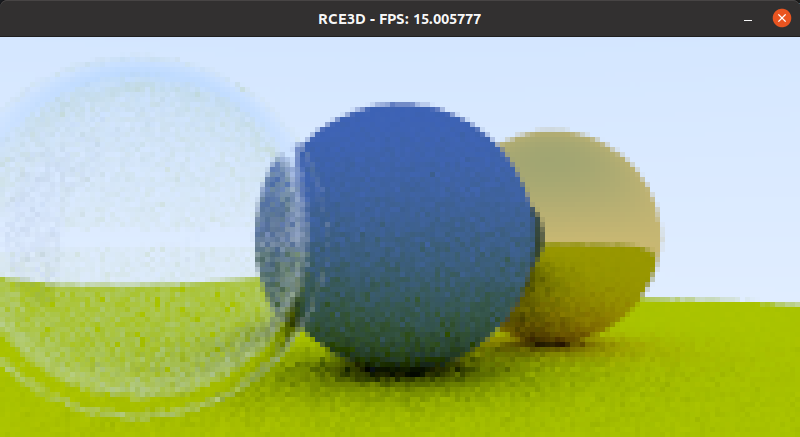

# RCE3D
## Description
RCE3D stands for Rainstorm Console Engine 3D but this is actually a simple real-time ray tracer. It uses [RCEngine](https://github.com/rainstormstudio/RCEngine), meaning that it only uses SDL2 for graphics. However, CUDA is used for optimizing the performance of the ray tracer.
## Screenshots

## License
The MIT License (MIT)

Copyright (c) 2020 Daniel Hongyu Ding

Permission is hereby granted, free of charge, to any person obtaining a copy of this software and associated documentation files (the "Software"), to deal in the Software without restriction, including without limitation the rights to use, copy, modify, merge, publish, distribute, sublicense, and/or sell copies of the Software, and to permit persons to whom the Software is furnished to do so, subject to the following conditions:

The above copyright notice and this permission notice shall be included in all copies or substantial portions of the Software.

THE SOFTWARE IS PROVIDED "AS IS", WITHOUT WARRANTY OF ANY KIND, EXPRESS OR IMPLIED, INCLUDING BUT NOT LIMITED TO THE WARRANTIES OF MERCHANTABILITY, FITNESS FOR A PARTICULAR PURPOSE AND NONINFRINGEMENT. IN NO EVENT SHALL THE AUTHORS OR COPYRIGHT HOLDERS BE LIABLE FOR ANY CLAIM, DAMAGES OR OTHER LIABILITY, WHETHER IN AN ACTION OF CONTRACT, TORT OR OTHERWISE, ARISING FROM, OUT OF OR IN CONNECTION WITH THE SOFTWARE OR THE USE OR OTHER DEALINGS IN THE SOFTWARE.

## Note
The code file can be found at https://github.com/rainstormstudio/RCE3D
Most concepts are based on [Ray Tracing in One Weekend](https://raytracing.github.io/books/RayTracingInOneWeekend.html#rays,asimplecamera,andbackground) and [Accelerated Ray Tracing in One Weekend in CUDA](https://developer.nvidia.com/blog/accelerated-ray-tracing-cuda/)

## Author
Daniel Hongyu Ding